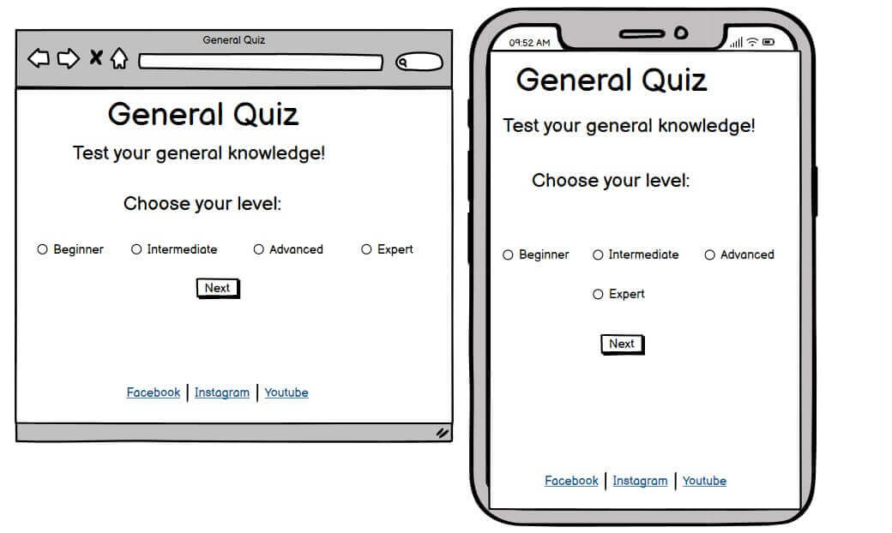
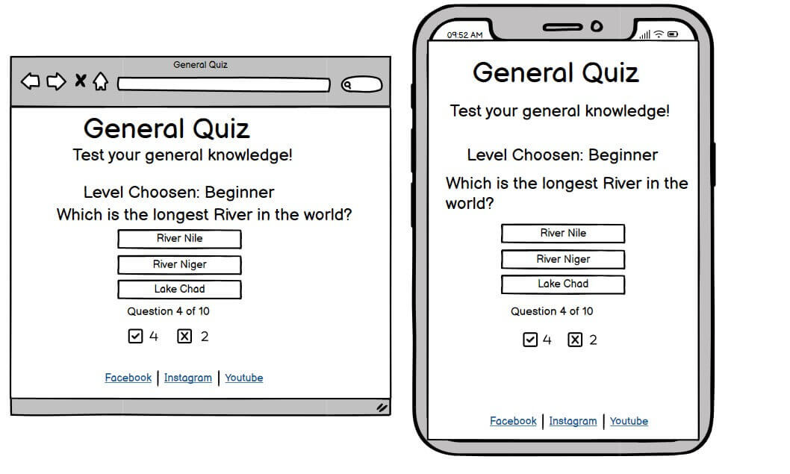
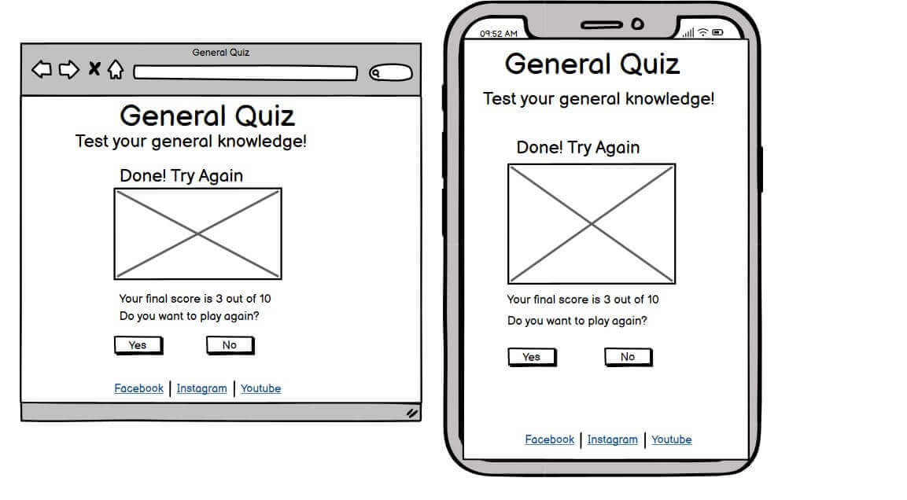

# General Quiz
(Developer: Theresa Wolff)

## Table of Content

1. [Introduction](#Introduction)
2. [Project Goals](#Project-Goals)

   i. [User Goals](#User-Goals)

   ii. [Site Owner Goals](#Site-Owner-Goals)
3. [User Experience](#User-Experience)

   i. [Strategy](#Strategy)

   * [Target Audience](#Target-Audience)
   * [User Requirements & Expectations](#User-Requirements-&-Expectations)
   * [User Stories](#User-Stories)

   ii. [Scope](#Scope)
   * [Initial Stage](#Intial-Stage)
   * [Future Additions](#general-quizFuture-Additions)

   iii. [Structure](#Structure)
   * [Wireframes](#wireframes)

   iv. [Skeleton](#Skeleton)
   * [Welcome](#Welcome-Section)
   * [Choose A Level](#Choose-a-Level-Section)
   * [Quiz Section](#Quiz-Section)
   * [End of Game](#End-of-Game-Page)
   * [Header](#Header)
   * [Footer](#Footer)
   * [Future Additions](#Future-Additions)

   v. [Surface](#Surface)
   * [Color Scheme](#Color-Scheme)
   * [Font](#Font)

4. [Technologies Used](#Technologies-Used)
   i. [Language](#Languages)

   ii. [Frameworks & Tools](#Frameworks--Tools)

   iii. [Helpful Sites](#Helpful-Sites)
5. [Testing and Validation](#Testing-and-Validation)

   i. [HTML](#Html-Validation)

   ii. [CSS](#css-Validation)

   iii. [JavaScript](#Javascript-Validation)

   iv. [Accessibility & Performance](#Accessibility-&-Performance)

   v. [Browser Compatability](#Browser-Compatability)

   vi. [Testing User Stories](#Testing-User-Stories)
6. [Bugs & Fixes](#Bugs-&-Fixes)
7. [Deployment & Development](#Deployment-&-Development)
8. [Credits](#Credits)

## Introduction

The General Quiz is a multiple-choice online quiz testing the users' general knowledge of history, biology, geography, IT, movies, and sports. When playing the game, the user can create a username and choose between several difficulty levels. The user gets feedback on the number of questions in the ongoing quiz and the score.

## Project Goals

### User Goals
* The site's user wants to play an online quiz to test their general knowledge of history, biology, geography, IT, movies, and sports.

### Site Owner Goals
* The site owner aims to provide the online user with an entertaining,  fun, enlightening,  and appropriately challenging quiz.

## User Experience

### Strategy

#### Target Audience
* Users are interested in history, biology, geography, movies, and sports.
* Users are looking for entertaining and enlightening content online.

#### User Requirements and Expectations
* Simple and intuitive navigation system.
* The links work as expected.
* Immediate feedback on progress.
* Visually appealing responsive design.
* Accessibility.

#### User Stories

##### First-time User 
As a first-time user, I want to ...
1. ... easily navigate through the quiz.
2. ... get clear feedback on my score.
3. ... quickly return to the chosen level section of the game and play again.

##### Returning Users
As a returning user, I want to ...
1. ... try a higher-level game.
2. ... see my previous scores.
3. ... find out more about the game developer.

##### Site Owner
As the site owner, I want users to ...
1. ... interact with the game, stay engaged, and enjoy the challenge.

### Scope

#### Initial Stage

At the early stage, the site will include a welcome section that displays the game's rules and lets the user create a username, then the user is given a choice of four levels of difficulty of the game. Finally, the game will start and run through 10 questions at the chosen level. An end of game page will then load and the user can opt to play the game again.

#### Future Additions

At the current stage of development, the user gets only essential feedback on their progress through a score tally below the question displayed. More feedback could be implemented in the future, such as delayed loading of the next question. During this delay, the chosen answer color background would change to indicate whether the answer was failed (red background) or correct (green background).
However, it would enhance the user's experience to save scores and keep track of progress. This could be achieved by adding a 'save score' option on the final page.
Finally, the Challenge Mode will be added, where the user will ask questions for other users. I will also add Timer for the quiz that will automatically run out. 

### Structure

#### Wireframes

The structure of the initial site will include three sections incorporated in the index.html page:

1. **Welcome Section**  displays the rules of the game and asks the user to create a username to play the game.

2. **Choose Level Section** with four difficulty levels of the game to chhose from.

3. **Quiz Section and score tracker** which runs through ten questions at the users chosen level of difficulty. It keeps track of the score in a score area below the answers.

4. **End of the Quiz Section** displays the users final score and level at which the game was played with a matching message. It gives the option to play the game again.

5. **404 Page** - a 404 Error page is also included (404.html)

### Skeleton

As described in the previous section with wireframes, the online game site includes four interactive sections: a heading, a central display area, and a footer. The welcome section requires the user to create a username to continue the game. The user is then prompted to choose the level they want to play the game. Upon choosing a level, the game loads and runs, adding to the score of correct or failed answers as the answers are chosen. A page displaying the final score is displayed at the end of the game.

#### Welcome Section

Screenshot of Welcome Section on desktop

* Features an input field. The user is required to create a username to continue. A submit button initiates the next section if a username has been entered. The rules of the game are also diplayed.

#### Choose A Level Section

Screenshot of the Choose a Level Section

* Features four clickable elements containing the choices of levels the user can opt for: Beginner, Intermediate, Advanced, and Expert.
* Includes the next buuton for the user to navigate to the quiz section.

#### Quiz Section and Score Tracker

Screenshot of Quiz Section

* Features the level the user has chosen.
* Features the question displayed at the top of the central content area.
* Three clickable text elements contain the multiple-choice answers.
* A scoring area below the answers updates the correct and failed answer tally every time the user chooses an answer. It also keeps track of the current and total number of questions.
* Feedback to the user includes the change of background color of the answer the user hovers over and the cursor changing to a pointer (these features are disabled on smaller screens).

#### End of Game page

Screenshot of End of Quiz Section 

* Features a personalized message posted on the page, depending on the score of the user. 
* An image in the center of the page makes the display more eye-catching and appealing.
* Includes the score of the user at the end of the game.
* Below the image, two clickable yes or no buttons allow the user to play again or not to play again.

#### Header

Screenshot of Header

* The header remains on display at the top of the game throughout a user's journey through the game.
* It tells the user clearly what the content and purpose of the application are.

#### Footer

Screenshot of Footer

* Featured on all pages (and the 404 page).
* Includes links to the social media pages that the general quiz maintains: Facebook, Instagram, and YouTube.
* All links open in a new window.
* The footer is fully responsive.

#### Future Additions

* To enhance the UX, the user could be given an option on the final page to save their scores. Another page or section could then appear that would display past scores of the user. 
* The Challenge Mode will be added, where the user will ask questions for other users. I will also add Timer for the quiz that will automatically run out. 

### Surface

The surface design of the site aims to attract the user to participate in the general quiz, have fun, entertain the user, and spend more time on my website while maintaining easy readability. A cloud background image, which is a great way to introduce a beautiful sense of calm to any website, was used. The color scheme and font were chosen accordingly.

#### Color Scheme

The color scheme aims to create an aesthetic feeling of style and appeal. The davy's gray and white colors were chosen together with the cloud background image for the purpose of simplicity, calmness, and a desire for them to blend together. All clickable buttons are styled with purple color. The Footer is styled light blue. The remaining features on the site,  silver background color, and font, are used in order to maintain contrast and readability.

#### Font

Open Sans is the font used for high-level headings in the game. The clickable text of level choices and answers and the score counter are in a matching Lato font. These fonts were chosen to maintain clarity and legibility on the site.

## Technologies Used

### Languages
* HTML
* CSS
* JavaScript

### Frameworks & Tools
* Git
* GitHub
* Gitpod
* Balsamiq
* Google Fonts
* Font Awesome
* Coolors. co
* Favicon
* TinyPNG
* Mockup Generator
* W3 Schools

### Helpful sites

The following site was helpful while developing the code to help with problem-solving:

* <a href="https://www.w3schools.com/">W3 Schools</a>
* <a href="https://stackoverflow.com">Stack Overflow</a>
* <a href="https://www.youtube.com/watch?v=S944-epyYuI">Javascript OnSubmit Event Tutorial for Beginners | How to Handle Forms in Javascript</a>
* <a href="https://www.youtube.com/watch?v=PBcqGxrr9g8">How To Make Quiz App Using JavaScript | Build Quiz App With HTML CSS &     JavaScript</a>

## Testing and Validation

### HTML Validation

 The W3C markup Validation Service was used to validate the HTML of the website. The code passed with no errors or warnings.

 

Welcome, Choose Level, Quiz and End of Quiz section

404 Error Page

### CSS Validation

The W3C Jigsaw CSS Validation Service was used to validate the CSS of the website. The code passed with no errors or warnings.

CSS Validation Screenshot

